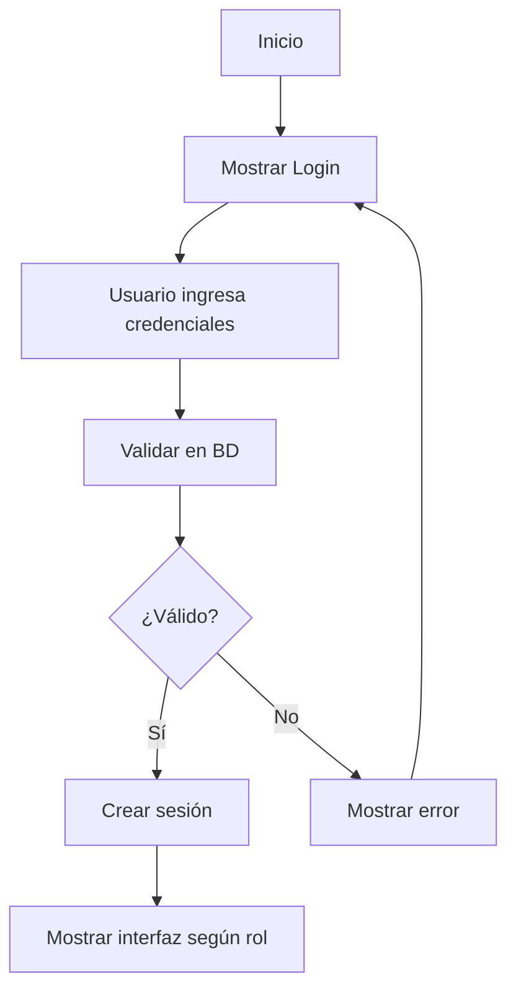
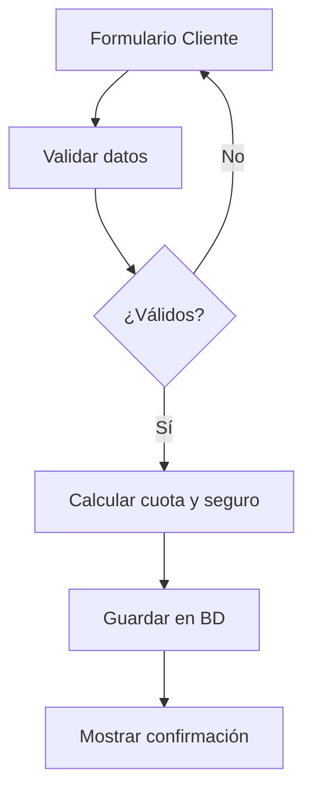
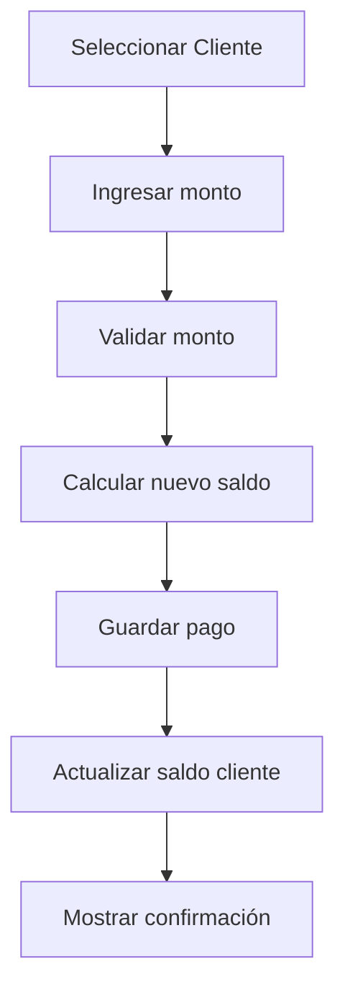

# Documentación para Desarrolladores - Gestor de Préstamos

## Índice
1. [Arquitectura del Sistema](#arquitectura-del-sistema)
2. [Estructura del Código](#estructura-del-código)
3. [Base de Datos](#base-de-datos)
4. [Flujo de Trabajo](#flujo-de-trabajo)
5. [APIs Internas](#apis-internas)
6. [Extensiones y Modificaciones](#extensiones-y-modificaciones)
7. [Debugging y Profiling](#debugging-y-profiling)
8. [Deployment](#deployment)

## Arquitectura del Sistema

### Patrón de Arquitectura
El sistema utiliza una **arquitectura en capas** con separación clara de responsabilidades:

```
┌─────────────────────────────────────┐
│           Capa de Presentación      │  ← UI (PyQt6)
├─────────────────────────────────────┤
│           Capa de Lógica            │  ← Business Logic
├─────────────────────────────────────┤
│           Capa de Datos             │  ← Data Access
├─────────────────────────────────────┤
│           Capa de Persistencia      │  ← SQLite Database
└─────────────────────────────────────┘
```

### Tecnologías Principales
- **Frontend**: PyQt6 para interfaz gráfica
- **Backend**: Python 3.8+ con lógica de negocio
- **Base de Datos**: SQLite para persistencia
- **Autenticación**: bcrypt para hash de contraseñas
- **Configuración**: python-dotenv para variables de entorno

### Principios de Diseño
1. **Separación de Responsabilidades**: Cada clase tiene una responsabilidad específica
2. **Bajo Acoplamiento**: Módulos independientes con interfaces claras
3. **Alta Cohesión**: Funcionalidades relacionadas agrupadas
4. **Principio DRY**: Evitar duplicación de código
5. **SOLID**: Aplicación de principios de diseño orientado a objetos

## Estructura del Código

### Organización de Directorios

```
src/
├── __init__.py                 # Inicialización del paquete
├── config.py                   # Configuraciones del sistema
├── database.py                 # Gestión de base de datos
├── usuario.py                  # Gestión de usuarios
├── cliente.py                  # Gestión de clientes
├── utils/                      # Utilidades generales
│   ├── __init__.py
│   ├── validators.py          # Validaciones de datos
│   ├── formatters.py          # Formateo de datos
│   └── helpers.py             # Funciones auxiliares
├── models/                     # Modelos de datos
│   ├── __init__.py
│   ├── user_model.py          # Modelo de usuario
│   ├── client_model.py        # Modelo de cliente
│   └── payment_model.py       # Modelo de pagos
├── services/                   # Servicios de negocio
│   ├── __init__.py
│   ├── auth_service.py        # Servicio de autenticación
│   ├── calculation_service.py # Servicio de cálculos
│   └── report_service.py      # Servicio de reportes
└── ui/                        # Interfaz de usuario
    ├── __init__.py
    ├── main_window.py         # Ventana principal
    ├── pages.py               # Páginas de la aplicación
    ├── widgets/               # Widgets personalizados
    │   ├── __init__.py
    │   ├── custom_table.py    # Tabla personalizada
    │   └── form_widgets.py    # Widgets de formulario
    └── styles/                # Estilos y temas
        ├── __init__.py
        └── default_style.py   # Estilo por defecto
```

### Módulos Principales

#### database.py
Gestiona todas las operaciones de base de datos:

```python
class Database:
    """Gestor principal de la base de datos SQLite."""
    
    def __init__(self, db_path: str = None)
    def crear_tablas(self) -> None
    def inicializar_admin(self) -> None
    def execute_query(self, query: str, params: tuple = ()) -> any
    def close(self) -> None
```

#### usuario.py
Gestiona la lógica de usuarios:

```python
class Usuario:
    """Gestor de usuarios del sistema."""
    
    def __init__(self, database: Database)
    def autenticar(self, username: str, password: str) -> dict
    def crear_usuario(self, datos: dict) -> bool
    def obtener_usuarios(self) -> list
    def cambiar_password(self, user_id: int, nueva_password: str) -> bool
```

#### cliente.py
Gestiona la lógica de clientes:

```python
class Cliente:
    """Gestor de clientes y préstamos."""
    
    def __init__(self, database: Database)
    def agregar_cliente(self, datos: dict, usuario_id: int) -> int
    def obtener_clientes(self, usuario_id: int) -> list
    def registrar_pago(self, cliente_id: int, monto: float, tipo: str) -> bool
    def calcular_cuota_minima(self, monto: float) -> float
```

## Base de Datos

### Esquema de Tablas

#### Tabla: usuarios
```sql
CREATE TABLE usuarios (
    id INTEGER PRIMARY KEY AUTOINCREMENT,
    username TEXT UNIQUE NOT NULL,
    password TEXT NOT NULL,
    nombre TEXT NOT NULL,
    rol TEXT NOT NULL,
    fecha_creacion DATETIME DEFAULT CURRENT_TIMESTAMP,
    activo BOOLEAN DEFAULT TRUE
)
```

#### Tabla: clientes
```sql
CREATE TABLE clientes (
    id INTEGER PRIMARY KEY AUTOINCREMENT,
    nombre TEXT NOT NULL,
    telefono TEXT,
    direccion TEXT,
    monto_prestamo REAL NOT NULL,
    interes REAL NOT NULL,
    plazo_dias INTEGER NOT NULL,
    cuota_minima REAL NOT NULL,
    seguro REAL NOT NULL,
    fecha_prestamo DATE NOT NULL,
    fecha_vencimiento DATE NOT NULL,
    saldo_actual REAL NOT NULL,
    estado TEXT DEFAULT 'activo',
    usuario_id INTEGER NOT NULL,
    fecha_creacion DATETIME DEFAULT CURRENT_TIMESTAMP,
    FOREIGN KEY (usuario_id) REFERENCES usuarios (id)
)
```

#### Tabla: pagos
```sql
CREATE TABLE pagos (
    id INTEGER PRIMARY KEY AUTOINCREMENT,
    cliente_id INTEGER NOT NULL,
    monto REAL NOT NULL,
    tipo TEXT NOT NULL,
    fecha_pago DATETIME DEFAULT CURRENT_TIMESTAMP,
    saldo_anterior REAL NOT NULL,
    saldo_nuevo REAL NOT NULL,
    observaciones TEXT,
    FOREIGN KEY (cliente_id) REFERENCES clientes (id)
)
```

### Índices para Optimización
```sql
CREATE INDEX idx_clientes_usuario ON clientes(usuario_id);
CREATE INDEX idx_pagos_cliente ON pagos(cliente_id);
CREATE INDEX idx_pagos_fecha ON pagos(fecha_pago);
```

### Migrations
Para futuras versiones, implementar sistema de migrations:

```python
class DatabaseMigration:
    def __init__(self, db: Database):
        self.db = db
        
    def get_current_version(self) -> int:
        """Obtiene la versión actual de la BD."""
        pass
        
    def migrate_to_version(self, target_version: int) -> bool:
        """Migra la BD a la versión especificada."""
        pass
```

## Flujo de Trabajo

### Flujo de Autenticación


### Flujo de Registro de Cliente


### Flujo de Registro de Pago


## APIs Internas

### Servicio de Cálculos

#### calculation_service.py
```python
class CalculationService:
    """Servicio para cálculos financieros."""
    
    @staticmethod
    def calcular_cuota_minima(monto_prestamo: float) -> float:
        """
        Calcula la cuota mínima basada en el monto.
        Regla: $2,000 por cada $50,000 prestados.
        """
        return (monto_prestamo / 50000) * 2000
    
    @staticmethod
    def calcular_seguro(cuota_minima: float) -> float:
        """Calcula el seguro igual a una cuota mínima."""
        return cuota_minima
    
    @staticmethod
    def calcular_interes_total(monto: float, tasa: float) -> float:
        """Calcula el interés total del préstamo."""
        return monto * tasa
    
    @staticmethod
    def calcular_fecha_vencimiento(fecha_prestamo: date, plazo_dias: int) -> date:
        """Calcula la fecha de vencimiento."""
        return fecha_prestamo + timedelta(days=plazo_dias)
```

### Servicio de Validaciones

#### validators.py
```python
class Validators:
    """Validadores de datos del sistema."""
    
    @staticmethod
    def validar_monto(monto: str) -> tuple[bool, str]:
        """Valida que el monto sea un número positivo."""
        try:
            valor = float(monto)
            if valor <= 0:
                return False, "El monto debe ser mayor a 0"
            return True, ""
        except ValueError:
            return False, "El monto debe ser un número válido"
    
    @staticmethod
    def validar_telefono(telefono: str) -> tuple[bool, str]:
        """Valida formato de teléfono."""
        if not telefono:
            return True, ""  # Opcional
        
        # Remover espacios y guiones
        telefono_limpio = re.sub(r'[\s\-\(\)]', '', telefono)
        
        if not telefono_limpio.isdigit() or len(telefono_limpio) < 10:
            return False, "Teléfono debe tener al menos 10 dígitos"
        
        return True, ""
```

### Servicio de Formateo

#### formatters.py
```python
class Formatters:
    """Formateadores de datos para visualización."""
    
    @staticmethod
    def formatear_moneda(monto: float) -> str:
        """Formatea un monto como moneda colombiana."""
        return f"${monto:,.0f} COP"
    
    @staticmethod
    def formatear_fecha(fecha: date) -> str:
        """Formatea una fecha en formato legible."""
        return fecha.strftime("%d/%m/%Y")
    
    @staticmethod
    def formatear_porcentaje(valor: float) -> str:
        """Formatea un decimal como porcentaje."""
        return f"{valor:.1%}"
```

## Extensiones y Modificaciones

### Agregar Nueva Funcionalidad

#### 1. Crear el Modelo
```python
# src/models/nueva_entidad.py
class NuevaEntidad:
    def __init__(self, datos: dict):
        self.id = datos.get('id')
        self.nombre = datos.get('nombre')
        # ... otros campos
```

#### 2. Extender la Base de Datos
```python
# En database.py, agregar nueva tabla
def _crear_tabla_nueva_entidad(self):
    query = """
    CREATE TABLE IF NOT EXISTS nueva_entidad (
        id INTEGER PRIMARY KEY AUTOINCREMENT,
        nombre TEXT NOT NULL,
        -- otros campos
        fecha_creacion DATETIME DEFAULT CURRENT_TIMESTAMP
    )
    """
    self.execute_query(query)
```

#### 3. Crear el Servicio
```python
# src/services/nueva_entidad_service.py
class NuevaEntidadService:
    def __init__(self, database: Database):
        self.db = database
        
    def crear(self, datos: dict) -> int:
        # Lógica para crear nueva entidad
        pass
```

#### 4. Agregar a la UI
```python
# src/ui/pages/nueva_entidad_page.py
class NuevaEntidadPage(QWidget):
    def __init__(self, service: NuevaEntidadService):
        super().__init__()
        self.service = service
        self.init_ui()
```

### Modificar Cálculos Existentes

Para modificar la lógica de cálculos, editar `calculation_service.py`:

```python
# Ejemplo: Cambiar regla de cuota mínima
@staticmethod
def calcular_cuota_minima(monto_prestamo: float, categoria_cliente: str = 'normal') -> float:
    """Cuota mínima variable según categoría de cliente."""
    
    base_cuota = (monto_prestamo / 50000) * 2000
    
    # Aplicar descuentos según categoría
    if categoria_cliente == 'premium':
        return base_cuota * 0.9  # 10% descuento
    elif categoria_cliente == 'vip':
        return base_cuota * 0.8  # 20% descuento
    
    return base_cuota
```

## Debugging y Profiling

### Sistema de Logging

#### Configuración básica
```python
# src/utils/logger.py
import logging
from src.config import LogConfig

def setup_logger(name: str) -> logging.Logger:
    """Configura el logger para el módulo."""
    
    logger = logging.getLogger(name)
    logger.setLevel(getattr(logging, LogConfig.LOG_LEVEL))
    
    # Handler para archivo
    file_handler = logging.handlers.RotatingFileHandler(
        LogConfig.LOG_FILE,
        maxBytes=LogConfig.MAX_LOG_SIZE,
        backupCount=LogConfig.BACKUP_COUNT
    )
    
    # Handler para consola
    console_handler = logging.StreamHandler()
    
    # Formatter
    formatter = logging.Formatter(LogConfig.LOG_FORMAT)
    file_handler.setFormatter(formatter)
    console_handler.setFormatter(formatter)
    
    logger.addHandler(file_handler)
    logger.addHandler(console_handler)
    
    return logger
```

#### Uso en los módulos
```python
from src.utils.logger import setup_logger

class Cliente:
    def __init__(self, database):
        self.db = database
        self.logger = setup_logger(__name__)
        
    def agregar_cliente(self, datos):
        self.logger.info(f"Agregando cliente: {datos['nombre']}")
        try:
            # lógica...
            self.logger.info(f"Cliente agregado exitosamente con ID: {cliente_id}")
            return cliente_id
        except Exception as e:
            self.logger.error(f"Error agregando cliente: {str(e)}")
            raise
```

### Debugging de la UI

#### Debug de eventos
```python
class MainWindow(QMainWindow):
    def __init__(self):
        super().__init__()
        self.debug_mode = os.getenv('DEBUG', 'False').lower() == 'true'
        
    def debug_print(self, message: str):
        if self.debug_mode:
            print(f"[DEBUG UI] {message}")
            
    def on_button_clicked(self):
        self.debug_print("Button clicked - executing action")
        # lógica del botón
```

### Profiling de Performance

#### Decorator para medir tiempo
```python
import time
import functools

def measure_time(func):
    """Decorator para medir tiempo de ejecución."""
    @functools.wraps(func)
    def wrapper(*args, **kwargs):
        start_time = time.time()
        result = func(*args, **kwargs)
        end_time = time.time()
        
        logger = logging.getLogger(func.__module__)
        logger.debug(f"{func.__name__} ejecutado en {end_time - start_time:.4f} segundos")
        
        return result
    return wrapper

# Uso
class Database:
    @measure_time
    def execute_query(self, query, params=()):
        # lógica de la query
        pass
```

## Deployment

### Crear Ejecutable con PyInstaller

#### 1. Instalar PyInstaller
```bash
pip install pyinstaller
```

#### 2. Crear spec file personalizado
```python
# gestor_prestamos.spec
import os
from PyInstaller import __main__

a = Analysis(
    ['app.py'],
    pathex=[os.getcwd()],
    binaries=[],
    datas=[
        ('src', 'src'),
    ],
    hiddenimports=[
        'PyQt6.QtCore',
        'PyQt6.QtWidgets',
        'PyQt6.QtGui',
        'bcrypt',
        'sqlite3',
    ],
    hookspath=[],
    hooksconfig={},
    runtime_hooks=[],
    excludes=[],
    win_no_prefer_redirects=False,
    win_private_assemblies=False,
    cipher=None,
    noarchive=False,
)

pyz = PYZ(a.pure, a.zipped_data, cipher=None)

exe = EXE(
    pyz,
    a.scripts,
    a.binaries,
    a.zipfiles,
    a.datas,
    [],
    name='GestorPrestamos',
    debug=False,
    bootloader_ignore_signals=False,
    strip=False,
    upx=True,
    upx_exclude=[],
    runtime_tmpdir=None,
    console=False,
    disable_windowed_traceback=False,
    argv_emulation=False,
    target_arch=None,
    codesign_identity=None,
    entitlements_file=None,
    icon='assets/icon.ico',  # Si tienes un icono
)
```

#### 3. Compilar
```bash
pyinstaller gestor_prestamos.spec
```

### Script de Build Automatizado

#### build.py
```python
#!/usr/bin/env python3
"""Script automatizado de build para Gestor de Préstamos."""

import os
import shutil
import subprocess
import sys
from pathlib import Path

def clean_build():
    """Limpia archivos de build anteriores."""
    dirs_to_clean = ['build', 'dist', '__pycache__']
    for dir_name in dirs_to_clean:
        if os.path.exists(dir_name):
            shutil.rmtree(dir_name)
            print(f"✓ Limpiado directorio: {dir_name}")

def run_tests():
    """Ejecuta las pruebas antes del build."""
    print("Ejecutando pruebas...")
    result = subprocess.run([sys.executable, '-m', 'pytest'], capture_output=True)
    if result.returncode != 0:
        print("❌ Las pruebas fallaron")
        return False
    print("✓ Pruebas exitosas")
    return True

def build_executable():
    """Construye el ejecutable."""
    print("Construyendo ejecutable...")
    result = subprocess.run(['pyinstaller', 'gestor_prestamos.spec'], capture_output=True)
    if result.returncode != 0:
        print("❌ Error en la construcción")
        print(result.stderr.decode())
        return False
    print("✓ Ejecutable construido exitosamente")
    return True

def create_installer():
    """Crea el installer con NSIS (Windows) o similar."""
    # Implementar según la plataforma
    pass

def main():
    """Función principal del script de build."""
    print("🚀 Iniciando build de Gestor de Préstamos")
    
    # 1. Limpiar
    clean_build()
    
    # 2. Ejecutar pruebas
    if not run_tests():
        sys.exit(1)
    
    # 3. Construir ejecutable
    if not build_executable():
        sys.exit(1)
    
    # 4. Crear instalador (opcional)
    # create_installer()
    
    print("🎉 Build completado exitosamente")
    print(f"Ejecutable disponible en: {os.path.abspath('dist')}")

if __name__ == "__main__":
    main()
```

### Distribución

#### Estructura para distribución
```
GestorPrestamos-v1.0.0/
├── GestorPrestamos.exe          # Ejecutable principal
├── README.md                     # Documentación
├── INSTALL.md                    # Guía de instalación
├── MANUAL_USUARIO.md            # Manual de usuario
├── LICENSE                       # Licencia
├── CHANGELOG.md                  # Registro de cambios
└── assets/                       # Recursos adicionales
    ├── icon.ico                  # Icono de la aplicación
    └── screenshots/              # Capturas de pantalla
```

#### Script de packaging
```bash
#!/bin/bash
# package.sh - Script para crear paquete de distribución

VERSION="1.0.0"
DIST_NAME="GestorPrestamos-v${VERSION}"

# Crear directorio de distribución
mkdir -p "dist/${DIST_NAME}"

# Copiar ejecutable
cp "dist/GestorPrestamos.exe" "dist/${DIST_NAME}/"

# Copiar documentación
cp README.md INSTALL.md MANUAL_USUARIO.md LICENSE CHANGELOG.md "dist/${DIST_NAME}/"

# Copiar assets si existen
if [ -d "assets" ]; then
    cp -r assets "dist/${DIST_NAME}/"
fi

# Crear archivo ZIP
cd dist
zip -r "${DIST_NAME}.zip" "${DIST_NAME}/"

echo "✓ Paquete creado: dist/${DIST_NAME}.zip"
```

---

Esta documentación proporciona una guía completa para desarrolladores que deseen entender, modificar o extender el sistema Gestor de Préstamos.