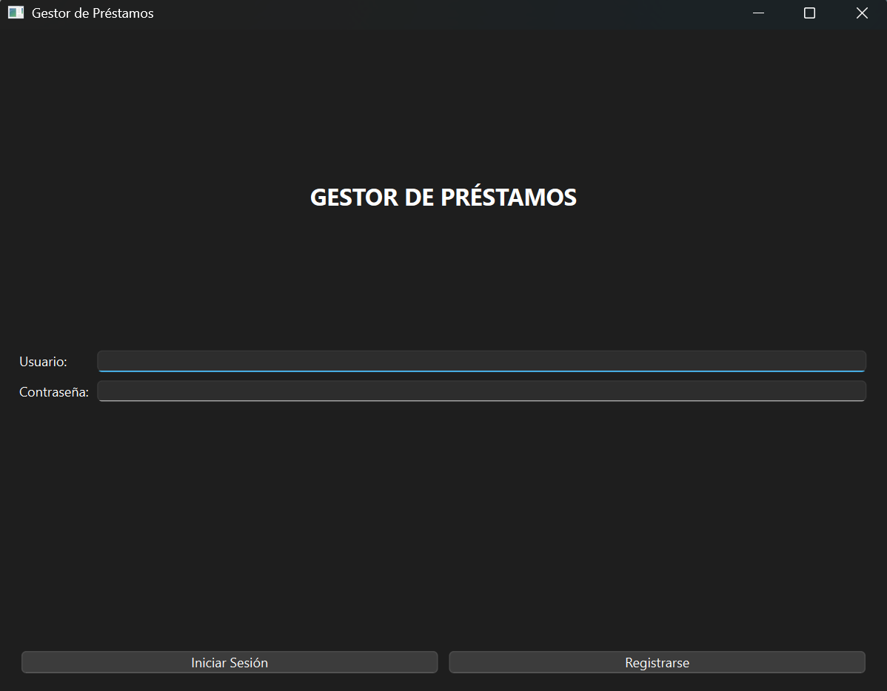
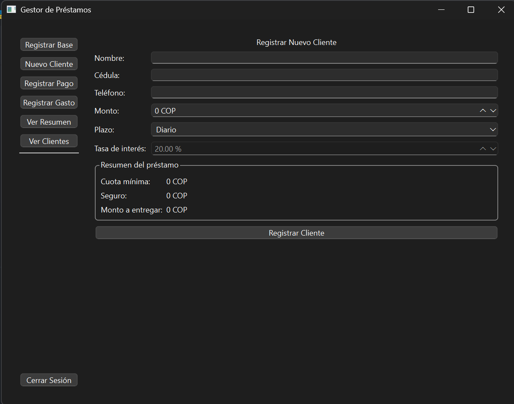
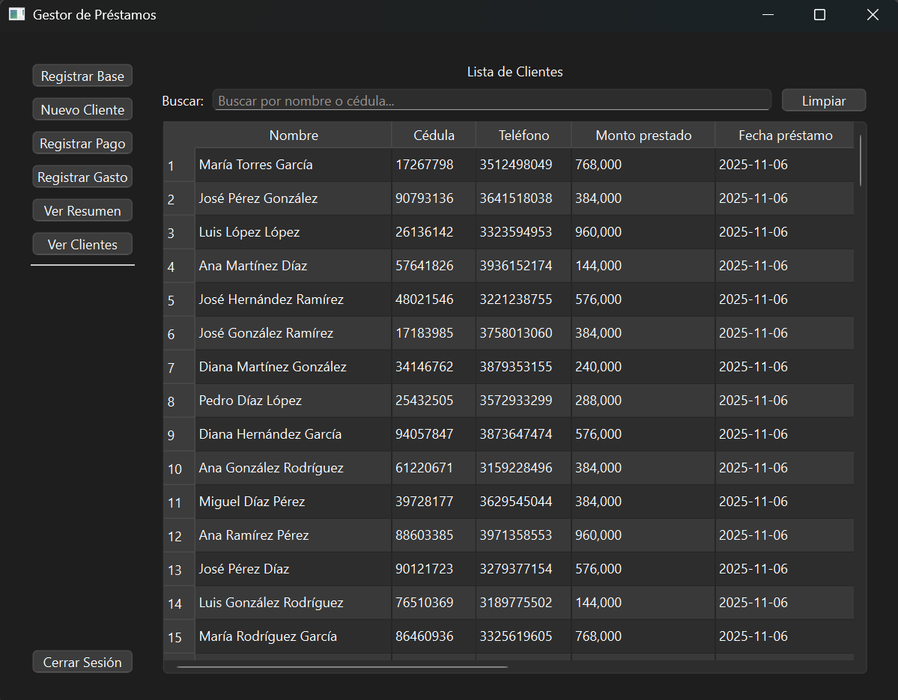

# Gestor de Préstamos - Sistema de Control de Cobros

[](https://github.com/Diego-Campo/Gestor-de-prestamos/blob/main/LICENSE)
[](https://github.com/Diego-Campo/Gestor-de-prestamos/stargazers)
[](https://github.com/Diego-Campo/Gestor-de-prestamos/issues)
[](https://www.python.org/downloads/)

Sistema profesional para la gestión y control de cobros de préstamos, diseñado para facilitar el trabajo de cobradores y administradores.

## Características

- Sistema multiusuario para cobradores
- Gestión de clientes y préstamos
- Control de pagos (efectivo y digital)
- Seguimiento de gastos
- Resumen semanal automatizado
- Cálculo automático de cuotas y balances
- Interfaz gráfica moderna y fácil de usar

## Requisitos

- Python 3.x
- PyQt6
- SQLite3

## Instalación

1. Crear un entorno virtual:
```bash
python -m venv .venv
```

2. Activar el entorno virtual:
```bash
# Windows
.venv\Scripts\activate
```

3. Instalar dependencias:
```bash
pip install PyQt6 bcrypt python-dotenv
```

## Estructura del Proyecto

```
gestor_prestamos/
│
├── src/                    # Código fuente
│   ├── ui/                # Interfaz de usuario
│   │   ├── __init__.py
│   │   ├── main_window.py # Ventana principal
│   │   └── pages.py       # Páginas de la interfaz
│   │
│   ├── database.py        # Gestión de base de datos
│   ├── usuario.py         # Lógica de usuarios
│   └── cliente.py         # Lógica de clientes
│
├── tests/                  # Pruebas y simulaciones
│   ├── __init__.py
│   └── test_simulacion.py # Script de simulación
│
└── app.py                 # Punto de entrada principal
```

## Ejecutar la Aplicación

Hay varias formas de ejecutar la aplicación:

### 1. Método Simple (Recomendado)
Usar el archivo batch incluido:
- Hacer doble clic en `ejecutar.bat`, o
- En PowerShell/CMD:
```bash
.\ejecutar.bat
```

### 2. Usando Python Directamente
```bash
.\.venv\Scripts\python.exe app.py
```

### 3. Usando el Entorno Virtual
Si necesitas activar el entorno virtual (para desarrollo), primero habilita la ejecución de scripts:
1. Abrir PowerShell como administrador
2. Ejecutar:
```powershell
Set-ExecutionPolicy -Scope CurrentUser -ExecutionPolicy RemoteSigned
```
3. Luego ya podrás activar el entorno virtual:
```bash
.\.venv\Scripts\activate
python app.py
```

## Uso de la Aplicación

1. Al iniciar la aplicación, se mostrará la pantalla de inicio de sesión.

2. Credenciales iniciales:
   - Para administrador:
     * Usuario: `admin`
     * Contraseña: `admin123`
   - Para cobradores:
     * Usuario: `cobrador1`, `cobrador2`, `cobrador3`
     * Contraseña: `pass1`, `pass2`, `pass3` (respectivamente)

3. Funciones según el rol:

   Para Cobradores:
   - Registrar base semanal
   - Gestionar clientes
   - Registrar pagos
   - Registrar gastos
   - Ver resumen semanal
   - Ver lista de clientes

   Para Administrador:
   - Panel de supervisión (monitoreo de cobradores)
   - Gestión de usuarios
   - Ver estadísticas generales

## Notas de Seguridad

1. **Cambio de Contraseñas**: 
   - Al primer inicio de sesión, se recomienda cambiar las contraseñas predeterminadas
   - Especialmente importante para la cuenta de administrador

2. **Permisos**:
   - Solo el administrador puede:
     * Eliminar usuarios
     * Ver información de todos los cobradores
     * Acceder a estadísticas globales
   - Los cobradores solo pueden:
     * Ver y gestionar sus propios clientes
     * Registrar sus propias operaciones

3. **Respaldo de Datos**:
   - La base de datos se almacena en `gestor_prestamos.db`
   - Se recomienda hacer copias de seguridad periódicas

## Pruebas

Para probar la aplicación con datos simulados:
```bash
.\.venv\Scripts\python.exe -m tests.test_simulacion
```

## Usuarios de Prueba

Los siguientes usuarios están disponibles para pruebas:

| Usuario    | Contraseña | Nombre               | Rol         |
|-----------|------------|---------------------|-------------|
| admin     | admin123   | Administrador       | Admin       |
| cobrador1 | pass1      | Juan Pérez         | Cobrador    |
| cobrador2 | pass2      | María López        | Cobrador    |
| cobrador3 | pass3      | Carlos Rodríguez   | Cobrador    |

**Nota**: Por razones de seguridad, se recomienda cambiar estas contraseñas en un entorno de producción.

## Características de los Préstamos

- Interés por defecto: 20%
- Interés personalizable para préstamos > $500,000
- Plazos disponibles: 30 o 40 días
- Cuota mínima: $2,000 por cada $50,000 prestados
- Seguro: Igual al valor de una cuota mínima

## Documentación Completa

### Para Usuarios
- **[Manual de Usuario](MANUAL_USUARIO.md)** - Guía completa paso a paso
- **[Guía de Instalación](INSTALL.md)** - Instalación y configuración
- **[Preguntas Frecuentes](FAQ.md)** - Solución a problemas comunes

### Para Desarrolladores
- **[Guía del Desarrollador](DEVELOPER_GUIDE.md)** - Arquitectura y extensiones
- **[Guía de Contribución](CONTRIBUTING.md)** - Cómo contribuir al proyecto
- **[Registro de Cambios](CHANGELOG.md)** - Historial de versiones

### Archivos del Sistema
- **[Licencia](LICENSE)** - Términos de uso (MIT License)
- **[Dependencias](requirements.txt)** - Lista de bibliotecas requeridas

## Inicio Rápido

1. **Descargar** el proyecto completo
2. **Ejecutar** haciendo doble clic en `ejecutar.bat`
3. **Iniciar sesión** con `admin/admin123`
4. **Cambiar contraseña** inmediatamente por seguridad
5. **Crear usuarios** para cada cobrador
6. **Comenzar** a gestionar clientes y pagos

## Capturas de Pantalla

### Pantalla de Login


### Registro cliente nuevo


### Gestión de Clientes



## Características Técnicas

### Tecnologías Utilizadas
- **Python 3.8+** - Lenguaje de programación principal
- **PyQt6** - Framework para interfaz gráfica
- **SQLite** - Base de datos embebida
- **bcrypt** - Encriptación de contraseñas

### Arquitectura
- **Patrón MVC** - Separación clara de responsabilidades
- **Base de datos relacional** - Integridad referencial
- **Interfaz responsive** - Adaptable a diferentes tamaños de pantalla
- **Logging integrado** - Seguimiento de eventos y errores

### Seguridad
- ✅ Contraseñas encriptadas con bcrypt
- ✅ Control de acceso basado en roles
- ✅ Validación de datos de entrada
- ✅ Sesiones seguras
- ✅ Logs de auditoría

### Rendimiento
- ✅ Base de datos optimizada con índices
- ✅ Carga lazy de datos grandes
- ✅ Caché de consultas frecuentes
- ✅ Interfaz responsive

## Versión y Compatibilidad

- **Versión actual**: 1.0.0
- **Compatibilidad**: Windows 10/11, Python 3.8+
- **Tamaño**: ~50 MB (incluyendo dependencias)
- **Memoria RAM**: 256 MB mínimo, 512 MB recomendado

## Soporte y Comunidad

### Reportar Errores
Si encuentras un error:
1. Consulta primero las [FAQ](FAQ.md)
2. Revisa si ya existe un issue similar
3. Crea un nuevo issue con información detallada

### Solicitar Funcionalidades
Para sugerir nuevas funcionalidades:
1. Revisa el [roadmap](CHANGELOG.md#próximas-versiones) 
2. Crea un issue con la etiqueta "enhancement"
3. Describe claramente el caso de uso

### Contribuir
¡Las contribuciones son bienvenidas! Consulta [CONTRIBUTING.md](CONTRIBUTING.md) para:
- Configurar el entorno de desarrollo
- Estándares de codificación
- Proceso de pull requests

## Licencia y Créditos

Este proyecto está licenciado bajo la **MIT License** - ver el archivo [LICENSE](LICENSE) para detalles.

### Desarrollado por
- **Diego Campo**
- GitHub: [@Diego-Campo](https://github.com/Diego-Campo)
- Email: campoviverodiego@gmail.com

### Agradecimientos
- Comunidad de PyQt6 por la excelente documentación
- Colaboradores y testers del proyecto
- Usuario final por feedback valioso

---

**⭐ Si este proyecto te es útil, considera darle una estrella en GitHub**

**📧 Contacto: campoviverodiego@gmail.com**

**🔗 Repositorio: [github.com/Diego-Campo/Gestor-de-prestamos](https://github.com/Diego-Campo/Gestor-de-prestamos)**